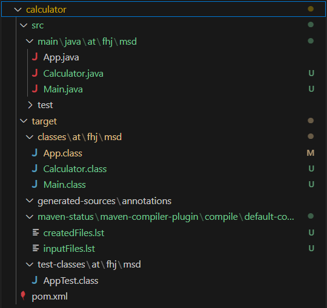
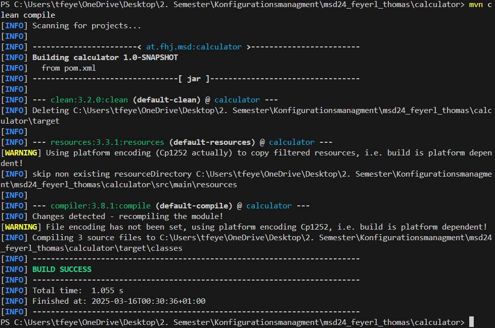
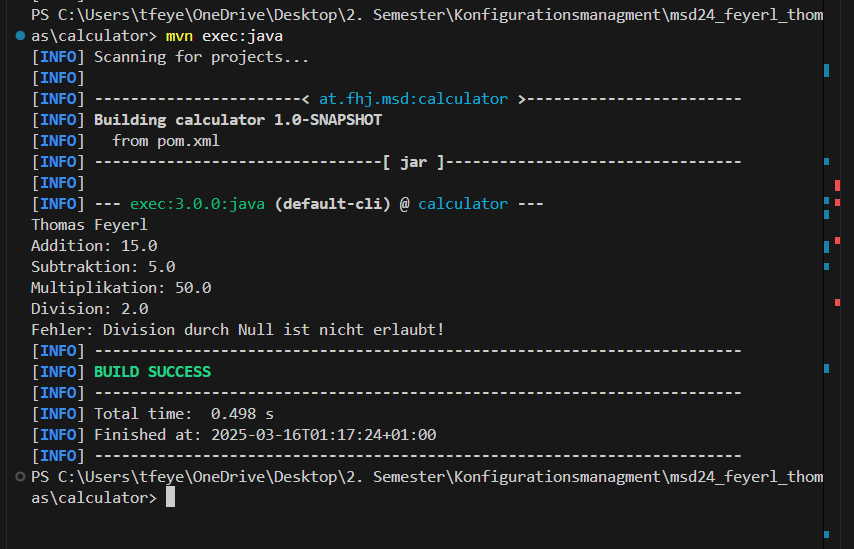

# **Exercise 3**

## **Exercise Instructions**

The goal of the third exercise is to version a Java project using Git and Maven. In this exercise, you will see various tools for build automation and review additional Git functionalities.

---

## **Prerequisites**

### Installations & Setup\*\*

- An **IDE** (e.g., VS Code or IntelliJ)
- **Maven** [🔗 Download](https://maven.apache.org/download.cgi) (use default settings)
- **OpenJDK** [🔗 Download](https://openjdk.java.net)
- The repository **msd_feyerl_thomas** has already been locally connected, as the project folder was automatically detected when opened.

## **Steps**

### Setting Environment Variables in PATH\*\*

1. Set `JAVA_HOME`, `MAVEN`, and `PATH` variables in the system environment variables.
2. Add the `bin` path of the programs to `PATH`:
   - **Java**
   - **Maven**

### Checking if Maven/Java is Installed Correctly in the Terminal\*\*

```sh
mvn -v
java -version
javac -version
```

### Creating a New Project with Maven\*\*

#### Creating a Maven Project in a Normal CMD Window

**This does not work in Windows PowerShell:**

```sh
mvn archetype:generate -DgroupId=at.fhj.msd -DartifactId=calculator -DarchetypeArtifactId=maven-archetype-quickstart -DinteractiveMode=false
```

#### Creating a Maven Project in PowerShell

```sh
mvn archetype:generate "-DgroupId=at.fhj.msd" "-DartifactId=calculator"
"-DarchetypeArtifactId=maven-archetype-quickstart" "-DinteractiveMode=false"
```

Note:
If the project was created using an IDE GUI, the .idea folder should be added to .gitignore.
Even though I used CMD, I added it as a precaution in case I push projects to the repository via an IDE GUI instead of the terminal in the future.

### Pushing the Git Project to the Repository Root\*\*

```sh
git add calculator/
git commit -m "Projekt mit Maven erstellt"
git push -u origin main
```

### New Folder After Build Process

After the first execution, the `target/` folder was created, containing the compiled Java classes.



### Successful Build

After running: `mvn compile`


### Build Process - Plugin Added


