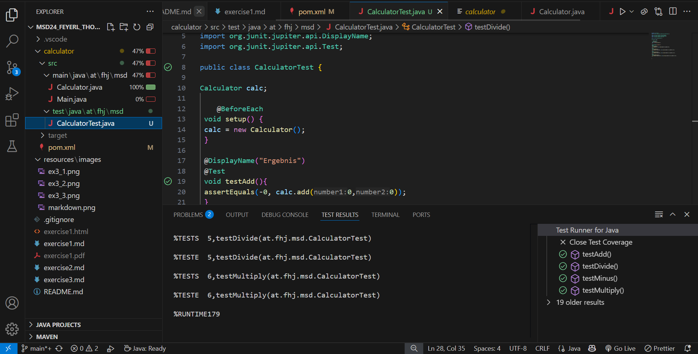
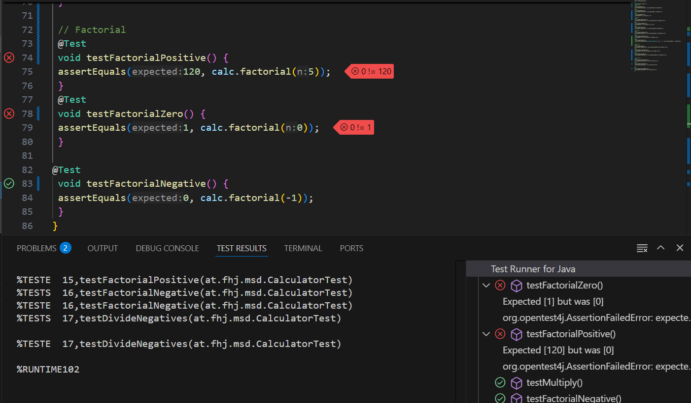

# JUnit Test Cases for the Calculator Class

---

## **Test Cases:**

### **Addition**

#### `testAddZeros()`

- **Description:** Tests the `add()` method with the values `0 + 0`
- **Expected Result:** `0`

#### `testAddPositive()`

- **Description:** Tests the `add()` method with the values `2 + 1`
- **Expected Result:** `3`

#### `testAddNegative()`

- **Description:** Tests the `add()` method with the values `-2 + -2`
- **Expected Result:** `-4`

---

### **Subtraction**

#### `testMinusPositives()`

- **Description:** Tests the `minus()` method with the values `4 - 3`
- **Expected Result:** `1.0`

#### `testMinusNegative()`

- **Description:** Tests the `minus()` method with the values `-4 - (-3)`
- **Expected Result:** `-1.0`

#### `testMinusZeros()`

- **Description:** Tests the `minus()` method with the values `0 - 0`
- **Expected Result:** `0`

---

### **Division**

#### `testDividePositives()`

- **Description:** Tests the `divide()` method with the values `4 / 2`
- **Expected Result:** `2.0`

#### `testDivideNegatives()`

- **Description:** Tests the `divide()` method with the values `-4 / 2`
- **Expected Result:** `-2.0`

#### `testDivideZero()`

- **Description:** Tests the `divide()` method with division by zero using `1 / 0`
- **Expected Result:** Throws `ArithmeticException`

---

### **Multiplication**

#### `testMultiply()`

- **Description:** Tests the `multiply()` method with the values `10 * 4`
- **Expected Result:** `40.0`

#### `testMultiplyNegative()`

- **Description:** Tests the `multiply()` method with the values `-10 * 4`
- **Expected Result:** `-40.0`

#### `testMultiplyZero()`

- **Description:** Tests the `multiply()` method with the values `0 * 4`
- **Expected Result:** `0.0`

---

### **Factorial**

#### `testFactorialPositive()`

- **Description:** Tests the `factorial()` method with input `5`
- **Expected Result:** `120`

#### `testFactorialZero()`

- **Description:** Tests the `factorial()` method with input `0`
- **Expected Result:** `1` (by definition)

#### `testFactorialNegative()`

- **Description:** Tests the `factorial()` method with a negative input `-1`
- **Expected Result:** `0` (handled internally by returning `0` for invalid input)

---

## **Exception Handling:**

### **Division by Zero**

In the `Calculator.java` implementation, the `divide()` method prevents division by zero by throwing an `ArithmeticException`:

```java
public double divide(double number1, double number2) {
    if (number2 == 0) {
        throw new ArithmeticException("Division by zero is not allowed!");
    }
    return number1 / number2;
}
```

---

## **Test Coverage**

To check the test coverage, I followed these steps:

1. Right-click on `CalculatorTest.java`
2. Select **More Run/Debug -> Run … with coverage**
3. The test coverage will be displayed.



## **Screenshot of n!**



The Test with negative number is working because of the method which i set in calculator.java to return 0, if a negative parameter is given.
